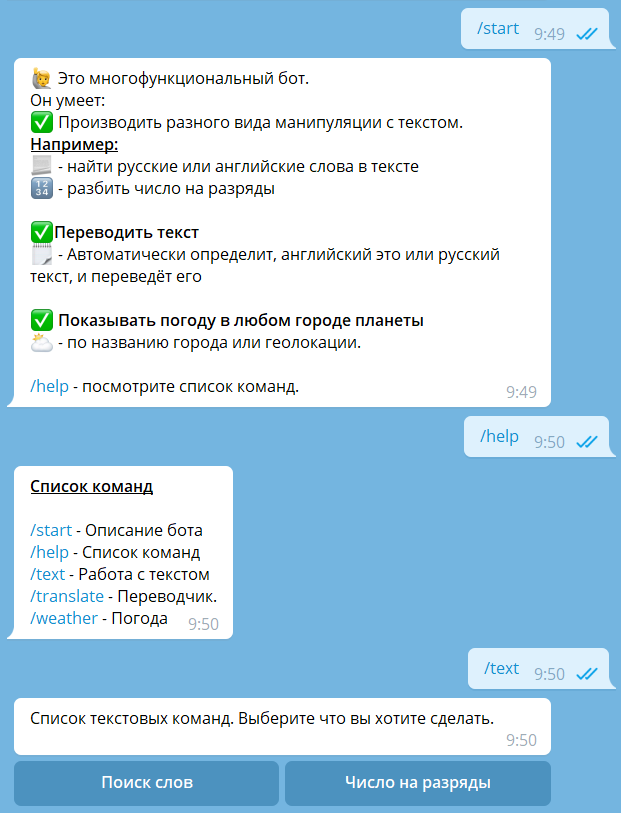
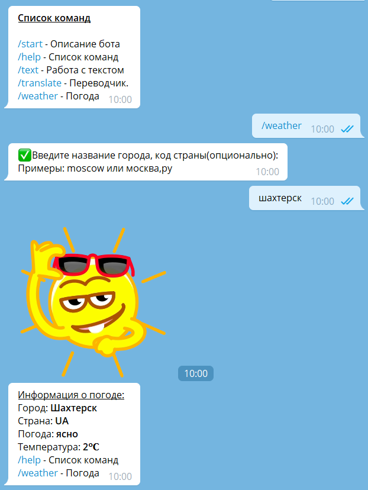
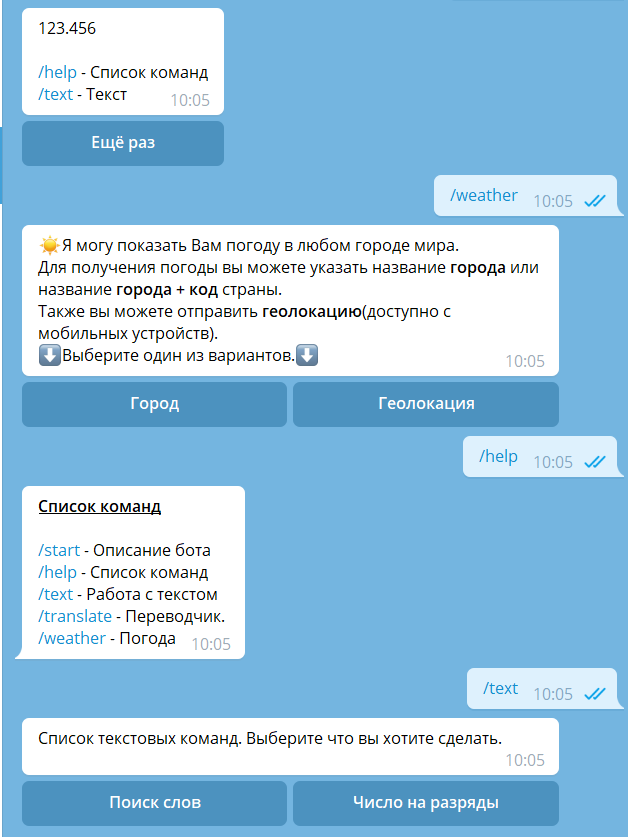

<h2 align="center">Telegram Bot</h2>

<h2>О боте</h2>

Бот написан с помощью библиотеки <a href="https://telegram-bot-sdk.readme.io/">Telegram Bot API - PHP SDK</a>

Состояние переписки хранится в базе данных.

Для перевода текста используется библиотека <a href="https://github.com/dejurin/php-google-translate-for-free">https://github.com/dejurin/php-google-translate-for-free</a>

Для получения погоды используется Weather API. <a href="https://openweathermap.org/api">https://openweathermap.org/api</a>

<h2>Требования</h2>

Нужно зарегистрироваться на <a href="https://openweathermap.org/">OpenWeatherMap</a> и получить токен.

